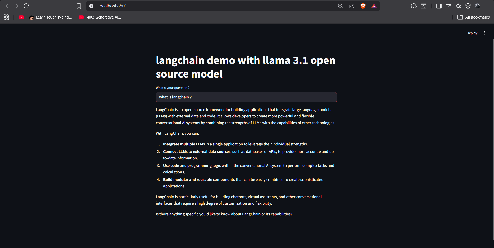
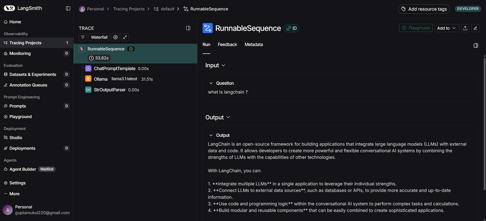

# 🧠 LangChain + Llama 3.1 + Streamlit Chatbot

This project is a simple AI chatbot built using **Streamlit**, **LangChain**, and the **Llama 3.1** model running locally with **Ollama**. It also includes **LangSmith Tracing v2** for monitoring and debugging LLM behavior in real time.

---

## 🚀 Project Overview

This chatbot allows users to ask questions through a clean Streamlit interface.  
Here’s how the components work together:

- **Streamlit** renders the user interface.
- **LangChain** manages prompt structuring and the LLM workflow.
- **Ollama** runs the **Llama 3.1 model** locally on your system.
- **LangSmith** tracks each interaction for debugging and observability.

This project is ideal for beginners who want to understand how local LLMs integrate with LangChain and Streamlit.

---

## 📂 Project Structure

The project includes:

- A **Streamlit application** that takes user input and displays AI responses.
- A **LangChain prompt template** organizing model instructions.
- A **locally running Llama 3.1 model** through Ollama.
- An `.env` file (excluded from GitHub) for storing environment variables securely.
- An `example.env` file showing required variables.
- A `README.md` that explains project setup and usage.

---

## 🔧 Environment Setup

To run this project successfully, you need:

- Python with required libraries (Streamlit, LangChain, dotenv, etc.)
- Ollama installed on your machine
- The Llama 3.1 model downloaded in Ollama
- A valid LangSmith API key for tracing
- A `.env` file containing required environment variables

The `.env` file is not included in the repository for security reasons, but an `example.env` file outlines what to include.

---

## ▶️ How to Run the Project

1. Install the necessary Python dependencies.
2. Install and run **Ollama**.
3. Ensure that the **Llama 3.1** model is available locally.
4. Create your own `.env` file based on the provided template.
5. Start the Streamlit application from the terminal.
6. Open the local server link in your browser to interact with the chatbot.

---

## 🔍 LangSmith Tracing

With LangSmith Tracing v2 enabled, each interaction with the chatbot is logged.  
This provides insights into:

- Prompt formatting  
- Model responses  
- Input/output flow  
- Debugging issues  

This makes it much easier to optimize prompts and analyze how the model behaves.

---

## 🧩 How It Works

1. The user enters a question into the Streamlit UI.  
2. LangChain formats this input using a structured prompt template.  
3. The message is processed by the **Llama 3.1 model** via Ollama.  
4. The generated response is displayed back to the user.  
5. LangSmith records the entire process for analysis.

---

---

